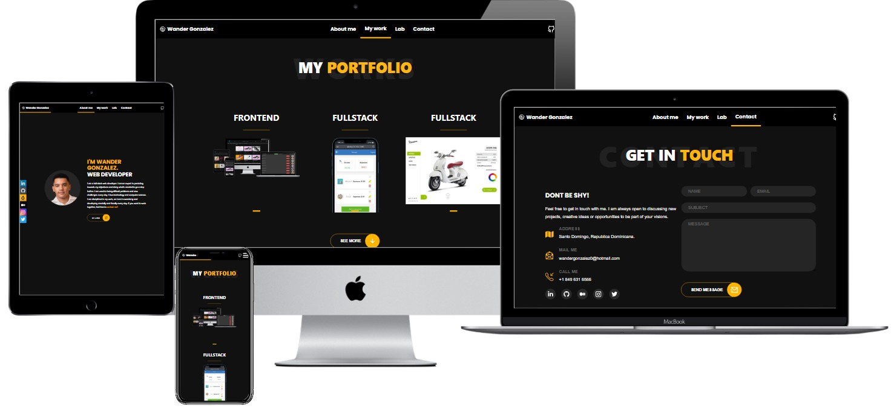
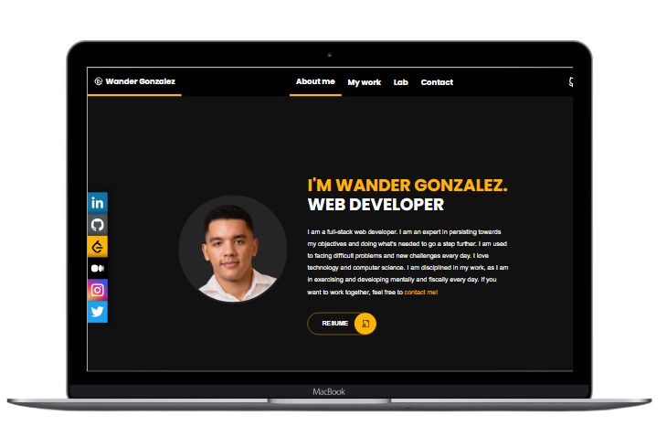

[](https://app.netlify.com/sites/wander-portfolio/deploys)

# Portfolio

This is my personal portfolio website made to showcase my work and experience. Made from scratch with different simple design inspirations. 

## Built With

- [React js]()
<!-- - [Redux](https://redux.js.org/) -->
<!-- - [Material UI/MUI](https://mui.com) -->
<!-- - [Jest](https://jestjs.io/) -->
<!-- - [React Testing library](https://testing-library.com/docs/react-testing-library/intro/) -->
<!-- - [GitHub CI workflows](https://github.com/wandergithub/e-commerce/actions) -->
  <!-- - Automated deployment -->
  <!-- - Automated testing -->
  <!-- - Automated linters -->
<!-- - [Platzi Fake store API](https://fakeapi.platzi.com/doc/categories#get-all-categories) -->

- Mobile first design
- Responsive web design


## App screenshots




## Live Demo

[Live Demo Link](https://wander-portfolio.netlify.app/)

## Usage 

Be sure to have [Node.js](https://nodejs.org/) installed before proceeding.

```shell
# Clone the repo
git clone https://github.com/wandergithub/w-portfolio.git
# Change directory
cd w-portfolio
# Install dependencies
npm install
# Start local server
npm start
```

<!-- ### Run tests -->

## Author 👤

[](https://github.com/wandergithub)&nbsp;

[](https://twitter.com/wanderklk1)&nbsp;

[](https://www.linkedin.com/in/wander-gonzalez/)&nbsp;

## 🛠️ Future features

- Update with an animated 3d background
- Add Open Source contrib section

## 🤝 Contributing

Contributions, issues, and feature requests are welcome!

Feel free to check the [issues page](../../issues/).

### You are welcome to collaborate on this projects

1. [Budget App](https://github.com/wandergithub/budget-app)

2. [Traveler's Hub](https://github.com/wandergithub/travelers-hub)

3. [Recipe App](https://github.com/wandergithub/Recipe-app)

## Show your support

Give a ⭐️ if you like this project!

## 📝 License

This project is [MIT](./MIT.md) licensed.
